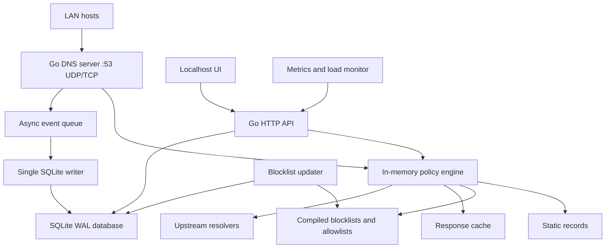

# TM-DNS Architecture Draft

Date: 2026-05-08

## Goal

Build a DNS-layer firewall that can run continuously on Macs with long uptime, provide reliable DNS for school networks, and expose a local web UI for safe operations:

- static DNS records
- realtime request and rule evaluation views
- host identity, host drilldowns, and host history
- watched hosts, IPs, and domains
- request timelines and block timelines
- detailed administrative reports
- one-click public blacklist enablement
- one-click site/domain blocking and allowlist override
- blocked access attempt visibility for school administrators
- system load documentation and live health
- simple deployment with few moving parts

The product should feel like the Emporia Vue 3 Mac Utility Monitor: local-first, operational, compact, and polished without becoming a heavy enterprise stack.

## Recommended Stack

### Core Service

Use Go for the daemon.

Reasons:

- Good fit for long-running network services with low idle overhead.
- Single static-ish binary distribution is practical for open-source macOS installs.
- Strong DNS libraries are available.
- Concurrency model is a good match for UDP/TCP request handling, background list refresh, event batching, and metrics.
- Easier to ship as a LaunchDaemon than a multi-process Python/Node service.

Primary DNS library candidate:

- `github.com/miekg/dns`

It supports UDP/TCP, IPv4/IPv6, server-side DNS programming, DNSSEC-related records, EDNS, TSIG, zone parsing, and DNS over TLS primitives. It is a library, not a full product, which gives us ownership of policy, UI, storage, and school workflows.

### Storage

Use SQLite with WAL mode.

SQLite is enough for a first production-grade version if we design the hot path correctly:

- DNS policy decisions should be served from memory.
- SQLite should persist settings, list metadata, audit events, and summarized query history.
- Raw query events should be written through an async queue and batched.
- Rollups should be maintained for common timeline views.
- WAL mode allows readers and a writer to run at the same time, but still has one writer. The design should assume one write pipeline.

SQLite should not be used as a synchronous decision engine for every DNS request.

Suggested pragmas and operational rules:

```sql
PRAGMA journal_mode=WAL;
PRAGMA synchronous=NORMAL;
PRAGMA busy_timeout=5000;
PRAGMA foreign_keys=ON;
```

Run checkpoints intentionally during idle periods or on a bounded interval so the WAL file does not grow without control.

### UI

Use an embedded web UI served by the Go daemon on `127.0.0.1`.

Frontend options:

- Conservative first choice: Vite + Vue 3 + TypeScript, compiled to static assets embedded in the Go binary.
- Simpler alternative: server-rendered Go templates with minimal JavaScript for charts and forms.

Given the desired UI richness, Vue 3 is reasonable if we keep it embedded and do not introduce a separate backend service. The Emporia reference repository already uses a local dashboard pattern; the visual style can be translated into a modern Vue app.

Recommended UI libraries:

- Vue 3 + TypeScript
- Vite
- Chart.js or Apache ECharts for timelines
- Lucide icons
- CSS variables for the Techmore olive/stone theme

Avoid a heavyweight app stack. No external web server, no separate Node server in production, no PostgreSQL requirement for baseline deployments.

### macOS Service Model

Use two components:

- `tmdns` LaunchDaemon: the actual DNS service, started at boot, auto-restarted by launchd, able to bind port 53, and independent of user login.
- `TM-DNS.app` menu bar helper: user-session status icon, dashboard launcher, notification surface, and service control bridge.

The menu app should not serve DNS. DNS must work at the login screen and after unattended reboot.

Status indicator:

- Green: daemon reachable, DNS listeners active, upstreams healthy, SQLite writer healthy, no event drops.
- Yellow: degraded, stale blocklists, high event queue, upstream failures, WAL checkpoint overdue, or recent dropped events.
- Red: daemon unreachable, DNS listener down, database unavailable, or service restart loop detected.

Recommended service controls:

- Open Dashboard
- Restart Service
- Reload Config
- Update Blocklists
- Open Logs
- Copy Diagnostics

Daemon health should be exposed through a local authenticated API or Unix socket. For the first implementation, bind admin HTTP to `127.0.0.1` only and protect state-changing operations with a local token stored under `/Library/Application Support/TM-DNS/`.

## Product Positioning

TM-DNS should be treated as a DNS-layer firewall and investigation console, not just a DNS sinkhole.

Modern firewalls are useful because they show traffic, rules, decisions, identities, and history in one place. TM-DNS should do the same at the DNS layer:

- Realtime traffic stream.
- Realtime rule matches.
- Clear allow/block/forward decisions.
- Host-centric investigation.
- Domain-centric investigation.
- Policy change history.
- Reports that can be shared with school leadership or IT staff.

The dashboard should let an admin move naturally from:

1. "Something is happening right now."
2. "Which host is doing it?"
3. "Which domain/category/rule is involved?"
4. "Has this happened before?"
5. "Should I block, allow, watch, or report it?"

## Blocky Decision

Blocky is a strong reference point. Its docs describe a Go DNS proxy/ad-blocker with blocking from external ad/malware lists, per-client-group rules, periodic reloads, regex support, custom DNS resolution, conditional forwarding, caching, multiple upstream resolvers, and Prometheus/Grafana integration.

There are three possible approaches:

| Option | Fit | Tradeoff |
| --- | --- | --- |
| Wrap Blocky as a managed subprocess | Fastest DNS/blocklist baseline | UI-driven live config, timeline storage, and packaging become a coordination problem |
| Fork Blocky | Reuses mature behavior | Long-term maintenance burden and upstream drift |
| Build our own Go daemon using DNS libraries | Best product ownership | More DNS behavior to implement and test |

Recommendation: build our own daemon for v1, while borrowing concepts from Blocky: upstream groups, blocklist groups, allowlists, cache controls, Prometheus metrics, and config validation. Keep a compatibility/import path for common blocklist formats.

This gives us direct control over:

- static record CRUD from the UI
- watched IP and watched domain timelines
- event retention and rollups
- school-friendly presets
- macOS packaging
- local system load reporting

## Service Architecture



## Hot Path

For each DNS request:

1. Normalize host identity, query name, and query type.
2. Check static records.
3. Check explicit allow rules.
4. Check explicit site/domain blocks.
5. Check blocklists.
6. Check cache.
7. Forward to upstream resolver group.
8. Return response.
9. Enqueue an event for persistence and metrics.

The request should not wait for SQLite unless it is an admin/configuration request. DNS should keep serving if the event queue is degraded, with visible dropped-event counters.

## Blocking Behavior

DNS blocking can stop resolution, but it cannot transparently redirect every blocked website to our UI in all cases.

Supported response modes:

- `NXDOMAIN`: domain appears nonexistent.
- `0.0.0.0` / `::`: common ad-block style null response.
- Sinkhole IP: resolve blocked domains to a local block page server.
- Refused: return DNS `REFUSED` for policy-denied domains.

Recommended default:

- Malware/phishing: sinkhole or `0.0.0.0`, configurable.
- Ads/tracking: `0.0.0.0` / `::`.
- Admin-created school blocks: sinkhole IP when a block page is configured.

Important browser behavior:

- HTTP sites can show a local block page when their domain resolves to the sinkhole IP.
- HTTPS sites will usually show a certificate warning if redirected to a local page because we do not own the blocked site's certificate.
- For HTTPS, the clean behavior is to stop resolution or sinkhole and record the attempt; the dashboard should explain the block from the admin side rather than relying on the student's browser showing a polished page.

The product should still make blocked attempts highly visible to administrators:

- realtime blocked-attempt feed
- host timeline
- domain timeline
- policy/list attribution
- one-click allow, temporary allow, escalate watch, or add note
- exportable audit trail

## Policy Model

Policy should be first-class, not only a blocklist toggle.

Entities:

- Global policy
- Host groups
- Hosts
- Static records
- Allow rules
- Deny rules
- Blocklist presets
- Custom blocklist sources
- Watched targets

Precedence:

1. Static records for local zones.
2. Emergency allow rules.
3. Host-specific allow rules.
4. Group allow rules.
5. Host-specific deny rules.
6. Group deny rules.
7. Global deny rules.
8. Public blocklists.
9. Cache/upstream resolution.

Every policy decision should store the winning rule or list source when practical. This matters for trust: an admin should be able to answer "why was this blocked?" from the UI.

## Host Identity

DNS requests arrive with a source IP. That is the minimum reliable identity. The product should enrich that source IP into a host profile whenever possible.

Identity sources:

- Source IP from the DNS request.
- Reverse DNS lookup, when useful and safe.
- DHCP lease import, if the school can provide a lease file or router export.
- ARP/neighbor table observation from the Mac host.
- NetBIOS/mDNS/Bonjour names where available.
- Manual labels entered by the admin.
- Optional CSV import for asset inventory.

Host profile fields:

- current IP
- known historical IPs
- hostname
- MAC address when known
- manually assigned display name
- group
- tags
- first seen
- last seen
- query count
- block count
- top domains
- top blocked domains
- watched status
- notes

Identity confidence should be visible. IP-based identity can drift on DHCP networks, so the UI should distinguish exact source IP observations from enriched hostname/MAC metadata.

Host history requirements:

- Timeline of all DNS actions for the host.
- Timeline of blocked attempts.
- Top requested domains by time range.
- New domains first seen by this host.
- Requests by hour/day to reveal timing patterns.
- Rule and policy matches over time.
- Report export for a selected host and date range.

## SQLite Model

Initial tables:

- `settings`
- `upstreams`
- `static_records`
- `hosts`
- `host_groups`
- `host_identities`
- `host_observations`
- `host_notes`
- `blocklist_sources`
- `blocklist_entries_meta`
- `allow_rules`
- `deny_rules`
- `watched_targets`
- `query_events`
- `block_events`
- `policy_decisions`
- `query_rollups_hourly`
- `query_rollups_daily`
- `domain_rollups_hourly`
- `host_rollups_hourly`
- `host_reports`
- `audit_events`
- `system_samples`

Retention:

- Keep raw query events for a configurable short window, default 7 to 30 days.
- Keep hourly rollups for 180 to 365 days.
- Keep daily rollups longer.
- Keep audit/configuration events indefinitely unless exported/deleted by admin.

Privacy:

- Provide a setting to redact full domains after rollup.
- Provide a setting to hash host identifiers.
- Make retention clear in the UI.

## Blocklist Management

Features:

- One-click presets: malware, phishing, ads/tracking, school-safe starter set.
- Source health: last fetch, HTTP status, entry count, parse errors, checksum, age.
- Atomic list compilation: fetch to staging, validate, compile, then swap into memory.
- Rollback to last known good list set.
- Per-list enable/disable.
- Per-host-group policy later.
- Allowlist always wins over public deny lists.
- Single-click block for a domain from any request, blocked event, host, or domain detail page.
- Temporary allow and temporary block with expiration timestamps.
- Dry-run mode to estimate impact before enabling a large list.
- False-positive workflow: unblock, annotate, and remember which source caused the decision.

Suggested preset sources should be reviewed before inclusion to avoid licensing or quality problems. Store source URL, license notes, expected format, update cadence, and category.

## System Load Requirements

The app needs to document and display its local load because the target machines may already run other school infrastructure.

Track:

- DNS QPS: current, 1 minute, 5 minute, 1 hour
- response latency: p50, p95, p99
- upstream latency and failures by resolver
- cache hit rate
- block rate
- event queue depth
- dropped event count
- SQLite write batch latency
- SQLite WAL size and checkpoint age
- blocklist refresh duration and memory delta
- process CPU percent
- resident memory
- open file descriptors
- goroutine count
- disk usage for database and logs
- launch uptime and last restart reason where available

Recommended guardrails:

- Bound the event queue.
- Batch writes.
- Keep DNS policy data in memory.
- Rate-limit expensive UI queries.
- Precompute rollups for timelines.
- Put list refresh in a low-priority background worker.
- Avoid verbose per-query log files by default.
- Expose warnings when the host is under load or event drops begin.

Testing targets to define:

- sustained QPS on Apple Silicon Mac mini and older Intel Mac mini
- memory use with common blocklist presets
- p95/p99 latency with cache hit, block hit, and upstream miss
- database growth per 1M queries
- list refresh time and peak memory
- behavior after sleep/wake, network changes, and long uptime

## Admin Dashboard Requirements

The UI needs to be materially better than Pi-hole-style dashboards by making investigation, realtime rule evaluation, host identity, and action the center of the product, not only charts.

### Dashboard

Purpose: answer "is DNS healthy and what needs attention?"

Required panels:

- Service health banner with daemon, DNS listeners, upstreams, database, blocklists, and event writer.
- Today traffic: queries, unique hosts, blocked count, block rate, cache hit rate, p95 latency.
- Realtime activity strip: latest requests and latest blocked attempts.
- Top hosts by query volume and block volume.
- Top hosts with unusual behavior.
- Top blocked domains and top newly seen domains.
- Recent rule hits and policy changes.
- List freshness and source errors.
- System load summary with warning states.

### Realtime

Purpose: provide a firewall-style live traffic and rule decision view.

Required features:

- Live stream of DNS requests with millisecond timestamps.
- Columns for host, source IP, hostname/confidence, group, domain, qtype, action, matching rule/list, upstream, latency, and response.
- Pause/resume, pin interesting rows, and quick filters.
- Rule-hit side panel showing the most active rules and lists right now.
- Quick actions: block, allow, temporary allow, watch host, watch domain, open host, open domain.
- Visual distinction between allowed, blocked, cached, static, refused, and upstream-failed requests.

### Requests

Purpose: investigate all DNS activity.

Required features:

- Live query table with pause/resume.
- Filters for time, host, group, domain, qtype, action, upstream, response code, list source, and watched status.
- Search by exact domain, suffix, host IP/name, or response IP.
- Row detail drawer showing request path, policy match, upstream latency, cache status, and related events.
- Actions: block domain, allow domain, watch domain, watch host, copy diagnostics.

### Blocked

Purpose: make blocked access attempts operationally useful.

Required features:

- Realtime blocked-attempt feed.
- "Why blocked?" attribution: rule, list, category, source URL, group/host policy.
- Grouped incidents by host and domain.
- First seen, last seen, attempt count, and timeline.
- One-click allow, temporary allow, escalate watch, add note, export incident.
- Block page hit tracking when sinkhole HTTP page is used.

### Hosts

Purpose: understand devices and users.

Required features:

- Host inventory with IP, MAC if known, hostname, identity confidence, group, first seen, last seen, query count, block count.
- Host detail page with timeline, top domains, blocked attempts, watched flags, timing patterns, rule matches, and notes.
- Host grouping for policies.
- Manual naming and optional DHCP/ARP import later.
- IP history and hostname history.
- Report export per host.

### Domains

Purpose: inspect a site/domain before taking action.

Required features:

- Domain detail page with request volume, hosts, actions over time, blocklist matches, resolved IP history, and related subdomains.
- One-click block root domain, exact domain, wildcard/suffix, or temporary block.
- One-click allow exact domain or suffix.
- Show blast radius estimate before broad wildcard/suffix blocks.

### Records

Purpose: manage local DNS.

Required features:

- Static A, AAAA, CNAME, TXT, MX, SRV records.
- Zone/group organization.
- Validation for record type, TTL, duplicate conflicts, and CNAME constraints.
- Import/export.
- Change history and rollback.

### Lists

Purpose: safely operate public and custom blocking lists.

Required features:

- Curated preset cards for malware, phishing, ads/tracking, threat intel, and school starter set.
- One-click enable/disable with preview.
- Source health: last update, next update, entry count, parse errors, license note, checksum, and category.
- Dry-run impact estimate based on recent traffic.
- Rollback to last known good compiled set.
- Custom source add/edit/test.

### Rules

Purpose: make the product feel like a firewall, where rules are visible and their effects can be inspected.

Required features:

- Ordered rules table with enabled state, scope, target, action, expiration, hit count, last hit, and owner/source.
- Reorder where precedence allows it.
- Hit timeline per rule.
- Rule detail page showing affected hosts/domains and recent matches.
- Create block/allow rule from request, host, domain, or blocked event.
- Disable rule with audit note.

### Policies

Purpose: make rules understandable.

Required features:

- Global policy overview.
- Host group policies.
- Rule precedence visualization.
- Temporary rules with expiration.
- Policy simulator: enter host plus domain and show expected decision.
- Change review before applying broad changes.

### Timelines

Purpose: make history readable.

Required features:

- Host, domain, IP, blocklist, and system timelines.
- Host timelines with query volume, block volume, new domains, and rule hits.
- Hourly/daily rollups.
- Annotation overlay for policy changes, list updates, restarts, and incidents.
- Compare before/after a policy or list change.

### Reports

Purpose: produce useful operational and audit summaries.

Required features:

- Host report: selected host, date range, top domains, blocked attempts, timing patterns, policy matches, notes, and CSV/JSON export.
- Domain report: selected domain, requesting hosts, blocks/allows over time, resolved IPs, and related subdomains.
- Block report: top blocked categories, lists, rules, hosts, and false-positive actions.
- Policy report: recent rule changes, high-impact rules, rule hit counts, and expired temporary rules.
- System report: load, uptime, database growth, list health, and service restarts.
- Scheduled report support can come later, but manual export should be in v1.

### Audit

Purpose: answer administrative questions later.

Required features:

- Immutable-style log of admin changes: who/what/when/from where.
- Service events: restarts, config reloads, list updates, database warnings.
- Policy changes with before/after.
- Export to CSV/JSON.

### Load

Purpose: prove the tool is not hurting the Mac.

Required features:

- CPU, memory, goroutines, file descriptors, uptime.
- DNS QPS and latency distributions.
- SQLite write queue, batch latency, WAL size, checkpoints.
- Blocklist refresh memory/time.
- Disk usage and retention forecast.
- Warnings with direct remediation actions.

### Settings

Purpose: configure safely.

Required features:

- Upstream resolvers and health checks.
- DNS bind address/port.
- Admin UI bind address and access token.
- Retention and privacy controls.
- Block response mode and sinkhole IP.
- Export/import/backup.
- Service install/uninstall status.

## macOS Deployment

Recommended layout:

```text
/Library/Application Support/TM-DNS/
  tm-dns.db
  config.toml
  lists/
  logs/

/Library/LaunchDaemons/com.techmore.tmdns.plist
/Applications/TM-DNS.app
```

Processes:

- `tmdns` LaunchDaemon for port 53 and 24/7 service.
- Optional menu bar app or regular `.app` wrapper to open the localhost dashboard, show status, and manage install/update.

Port 53 on macOS requires elevated privileges or launchd socket activation. The first implementation should document this explicitly and provide an installer script.

## UI Information Architecture

Use the Emporia dashboard style but adapt it for DNS operations.

Views:

- Dashboard: service status, QPS, latency, block rate, cache hit rate, list health, top hosts.
- Realtime: live firewall-style request stream with matching rules and quick actions.
- Requests: searchable query stream with filters for host, domain, type, action, upstream, and time.
- Blocked: realtime blocked access attempts with attribution, notes, and one-click action.
- Hosts: IPs, hostnames, MACs when known, groups, watched status, recent activity, detail timelines, reports, and policy membership.
- Domains: domain investigation, resolved IP history, related subdomains, and quick block/allow.
- Records: static A, AAAA, CNAME, TXT, MX, SRV records with validation.
- Rules: firewall-style ordered rule table, hit counts, recent matches, and quick enable/disable.
- Lists: one-click presets, source health, allowlist, denylist, update now, rollback, dry-run impact.
- Policies: global and client group rules, precedence, temporary rules, and simulator.
- Timelines: watched IP/domain/host timelines and rollups.
- Reports: host, domain, block, policy, and system reports with export.
- Audit: admin changes, service events, policy changes, exports.
- Load: CPU, memory, SQLite, queue, list refresh, and uptime diagnostics.
- Settings: upstream resolvers, retention, privacy, block response mode, service controls, export/import.

Theme translation:

- Fonts: Inter for UI, Instrument Serif for large values/headings.
- Palette: olive and stone base, with restrained red/amber/green status colors.
- Layout: sticky top nav, compact cards, dense tables, timeline charts, no marketing hero.
- Components: status dots, badges, sparklines, data tables, filter chips, segmented controls, toggles, and icon buttons.

## API Sketch

```text
GET  /api/health
GET  /api/metrics
GET  /api/dashboard
GET  /api/realtime
GET  /api/requests
GET  /api/blocked
GET  /api/timelines
GET  /api/records
POST /api/records
PUT  /api/records/:id
DEL  /api/records/:id
GET  /api/blocklists
POST /api/blocklists/:id/enable
POST /api/blocklists/:id/disable
POST /api/blocklists/refresh
POST /api/blocklists/rollback
GET  /api/hosts
GET  /api/hosts/:id
PUT  /api/hosts/:id
GET  /api/domains/:domain
GET  /api/rules
POST /api/rules/block
POST /api/rules/allow
POST /api/rules/simulate
GET  /api/reports/host/:id
GET  /api/reports/domain/:domain
GET  /api/reports/blocks
GET  /api/reports/policy
GET  /api/reports/system
GET  /api/audit
GET  /api/settings
PUT  /api/settings
POST /api/service/reload
POST /api/service/restart
```

Keep destructive changes behind confirmation in the UI and always write audit events.

## Open Questions

- Should v1 support per-host policies, or ship global plus group policy first and add per-host overrides later?
- Should DoH/DoT be included in v1, or should v1 stay UDP/TCP only?
- Should the UI be reachable only from localhost, or optionally from an admin subnet with auth?
- Should schools be able to import DHCP leases for host names?
- Which host identity sources should be supported in v1: manual labels only, ARP/neighbor table, DHCP import, or all three?
- What public blocklist sources are acceptable from a license and reliability standpoint?
- What is the minimum supported macOS version?
- What should the default block response be for school-created blocks: `0.0.0.0`, `NXDOMAIN`, or sinkhole IP?
- Should the sinkhole HTTP page run in the same daemon or a separate listener/process?
- What is the required audit retention period for schools?

## Implementation Readiness

Ready for an implementation spike: yes.

Ready for full production implementation: not yet.

Reasons to prototype first:

- DNS blocking and sinkhole behavior must be tested across HTTP, HTTPS, browser DNS cache, Apple Private Relay/iCloud settings, and common school client environments.
- SQLite event tracking needs measured write throughput and dashboard query performance under realistic traffic.
- macOS LaunchDaemon install/restart behavior needs validation around port 53, permissions, sleep/wake, network changes, and unattended reboot.
- UI data shapes should be proven with mocked but realistic school traffic before locking API contracts.

Spike acceptance criteria:

- Serve UDP/TCP DNS continuously for 24 hours with synthetic traffic and no event-writer stalls.
- Resolve static records and forward upstream with measured p95 latency.
- Block exact and suffix domains with clear attribution.
- Record blocked attempts and display them in a dashboard table/timeline.
- Enrich source IP into a host profile with at least manual labels and observed IP history.
- Show realtime request stream with rule match and action.
- Generate a basic host report for a selected time range.
- Enable/disable one curated blocklist preset and atomically swap compiled policy.
- Run as a LaunchDaemon and expose green/yellow/red status to a menu bar helper or stub status client.
- Show load metrics: QPS, p95 latency, memory, CPU, SQLite queue depth, dropped events, and WAL size.

## Initial Build Plan

1. Create Go module and service skeleton.
2. Implement config loading and SQLite migrations.
3. Implement DNS UDP/TCP listener with static records and upstream forwarding.
4. Add event queue and SQLite writer.
5. Add localhost HTTP API and embedded UI shell.
6. Add blocked-attempt event model, sinkhole response mode, and block page listener.
7. Add host identity model with manual labels and observed IP history.
8. Add realtime request stream with rule match visibility.
9. Add blocklist source fetch/compile/swap.
10. Add one-click block/allow and policy simulator.
11. Add host detail and basic host report.
12. Add load metrics and dashboard.
13. Add LaunchDaemon installer, uninstall path, and menu bar status helper.
14. Add load tests and long-run soak test instructions.

## Sources Checked

- Blocky interfaces and feature docs: https://0xerr0r.github.io/blocky/v0.23/interfaces/
- `miekg/dns` README: https://github.com/miekg/dns
- SQLite WAL docs: https://www.sqlite.org/wal.html
- Theme reference repository: https://github.com/techmore/Emporia-Vue3-Mac-Utility-Monitor
